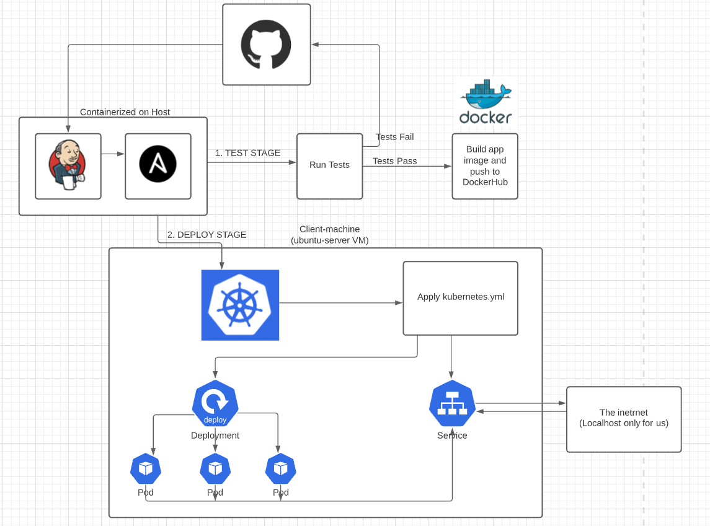

Please follow the live [document](https://docs.google.com/document/d/17OwlITE-yPWNj3Vi5RtQfz3ItvSkOfnbaVMnzlZyGTg)

# Additional Documentation for Tom's Case-study pipeline

## Environment Setup
- This project uses a Jenkins instance running in an ubuntu container on a Windows 10 Host. It shoould have all the necessary tools (Ansible, Jenkins), I will refer to it as the "master-controller"
- Our target machine is an ubuntu-server VM, I will refer to it as our "client machine". Note: Because it is the server version it has no GUI.
- Ensure that both instances have "openssh-server" installed with a "sudo apt install \<package name\>".
- Generate a public ssh-key for your master-controller and copy it into the authentication folder of your client-machine. Also enable passwordless sudo execution for your user if one was created (ubuntu-server will default as root and will not create a user for you) through the "sudo visudo" command. Copy your user from the top of the file, and paste it at the bottom of this file, then delete the original reference to your user. Add "NOPASSWD: ALL" to the end of the line you just pasted at the bottom (remove the extra "ALL").

## Steps 
- Add required files to local project. These include: requirements.txt, Dockerfile, Jenkinsfile, kubernetes.yml, at minimum.

- Create an environment for Jenkins to run on. 

    // In this case we are running a container locally with ansible and jenkins installed.

- Create a Jenkins pipeline and add this git repository under SCM checkout, targeting the Jenkinsfile in this directory. 

    // We may normally have a separate repository for these config files, but for the purpose of this assignment we are grouping them all in the application repository.

- Add code for Kubernetes Deployment and Services configuration ymls

    // Deployment should define three replicas

- Add code to Jenkinsfile which should go through these steps

    ### Stage: Build // We skp tests because there are none
    - Create a container for our application with a base image appropriate to the app (python3, flask or some similar image)
    - Clone the github repository into the container
    - Run a docker build command to create a new image inside this container as described by our Dockerfile
    - Push to docker hub

        // This will require your DockerHub credentials setup in Jenkins credentials
    
    ### Stage: Deploy
    - Instruct our ansible controller to start minikube, which will serve as our kubernetes control plane. 
    
        // Because ansible is installed in the same instance as our Jenkins, we can run ansible commands (ad-hoc ro playbooks) from inside our jenkinsfile. 

    - If our kubernetes.yml is filled out, we can have ansible apply it to our cluster.
    - Success! Kubernetes should have created 3 pods that are running our application. Try exposing the service and accessing the static web app!

## Here is a visual representation of our pipeline

